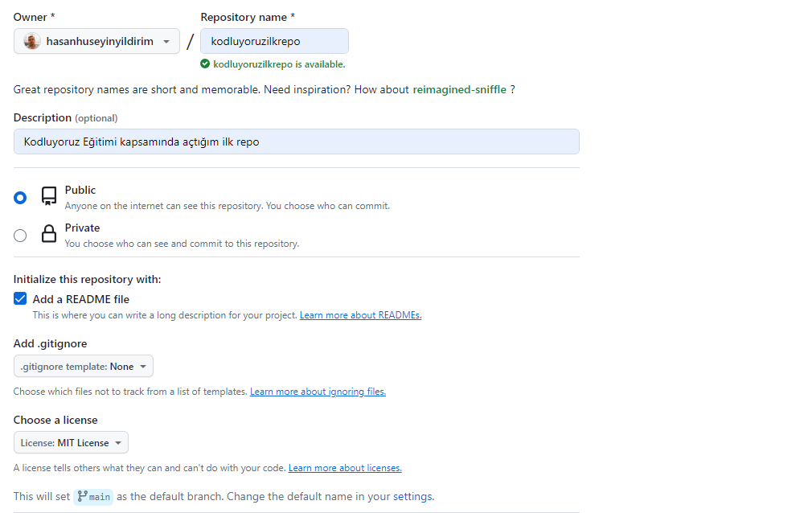

# Kodluyoruz İlk Repo
Bu repo [Kodluyoruz](https://www.kodluyoruz.org/) Front-End Eğitiminde oluşturduğumuz ilk repo.İçerisinde bir adet README dosyası,bir adet de index.html barındırıyor.



## Installation
Öncelikle projeyi klonlayın.

`git clone https://github.com/hasanhuseyinyildirim/kodluyoruzilkrepo.git` 
## Usage
Projeyi klonladıktan sonra Visual Studio Code programında açınız.

Linux için:
``` 
cd kodluyoruzilkrepo 
code. 
``` 
## Contributing

Pull requestler kabul edilir.Büyük değişiklikler için, lütfen önce neyi değiştirmek istediğinizi tartışmak için bir konu açınız.
## License

[MIT](https://github.com/hasanhuseyinyildirim/kodluyoruzilkrepo/blob/main/LICENSE)

